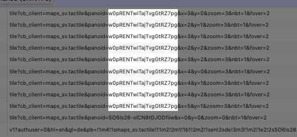

# MALLGRABBER
*Steal google streetview panorama images*

# install
- in a terminal, change directory into this git repo!
- run `npm install`

# use
- then run the command with node directly `node index.js [name prefix] [pano id] [zoom (1-5)]`

### pano-what??
the panoid is googles ID for each 360 panorama. if you open the developer console and search panoid in the networktab you'll see many requests as you move the view.

looking at the urls in the network console:

# image library
for reference we use 'images' from npm. very good library doesnt need any bullshit imagemagick preinstalls or anything
https://github.com/zhangyuanwei/node-images